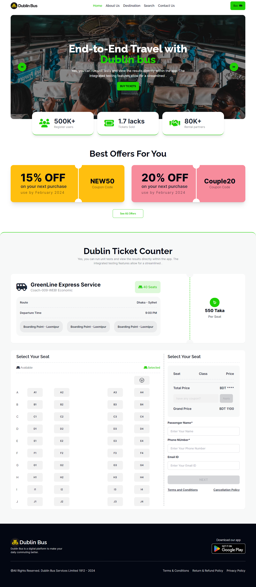

<h2>About the project</h2>

  <h4><b>Dublin Bus</b> Online Bus seat booking Website with JS</h4>

👉 Live Demo: <a target='_blank' href='https://mehedi7242.github.io/dublin-bus-page/'>Dublin Bus</a>

<h3>Build with:</h3>

<li>html</li>
<li>Tailwind CSS</li>
<li>JS</li>

<h2>Screenshots of the Project 🖼️</h2>

